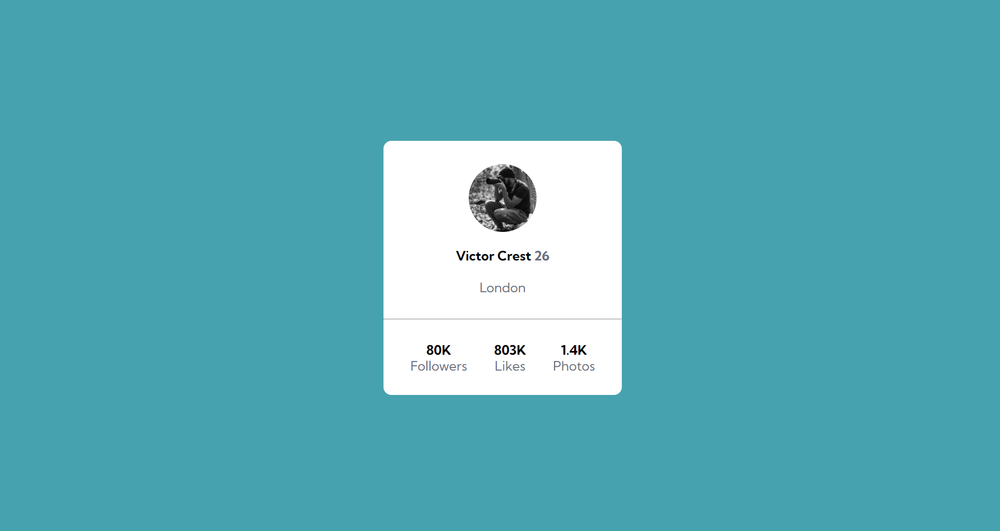
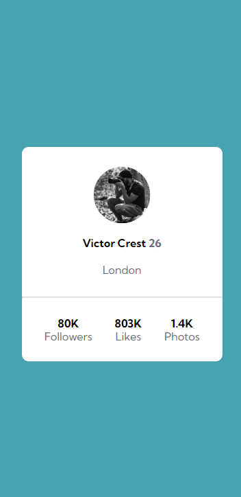

## 
<h1>Profile card component</h1>

 This is a profile card component built as an exercise for advanced HTML and CSS practicing, proposed by the course <a href="https://devemdobro.com/matriculas-abertas/" target="_blank">DevQuest</a> by Dev em Dobro. The project is from Frontend Mentor.

<h2>Overview</h2>
<h3>Screen preview</h3>
<h4>Desktop</h4>

<h4>Mobile</h4>

<h3>Link</h3>
<ul>
    <li>Live site URL: <a href="https://julianastahelin.github.io/css-my-site/">https://julianastahelin.github.io/profile-card-component/</a></li>
</ul>

<h2>My process</h2>

<h3>Built with 👩🏽‍💻</h3> 
<ul>
    <li>HTML 5;</li>
    <li>CSS 3.</li>
</ul>

<h3>What I learned 💪🏽</h3>
<ul>
    <li>CSS Flexbox;</li>
    <li>CSS Variables.</li>
</ul>
